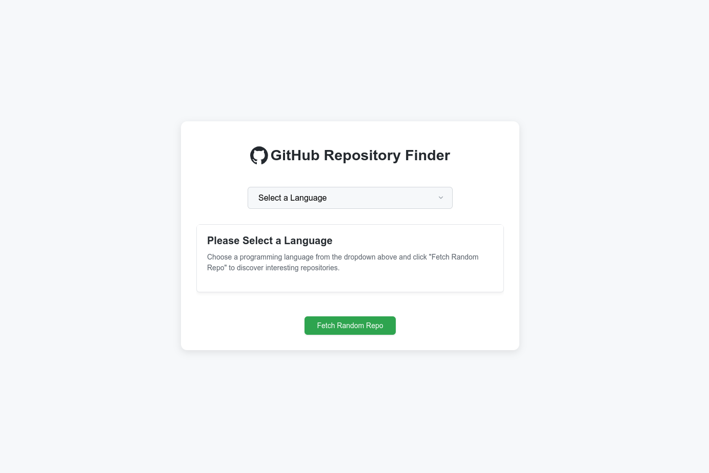
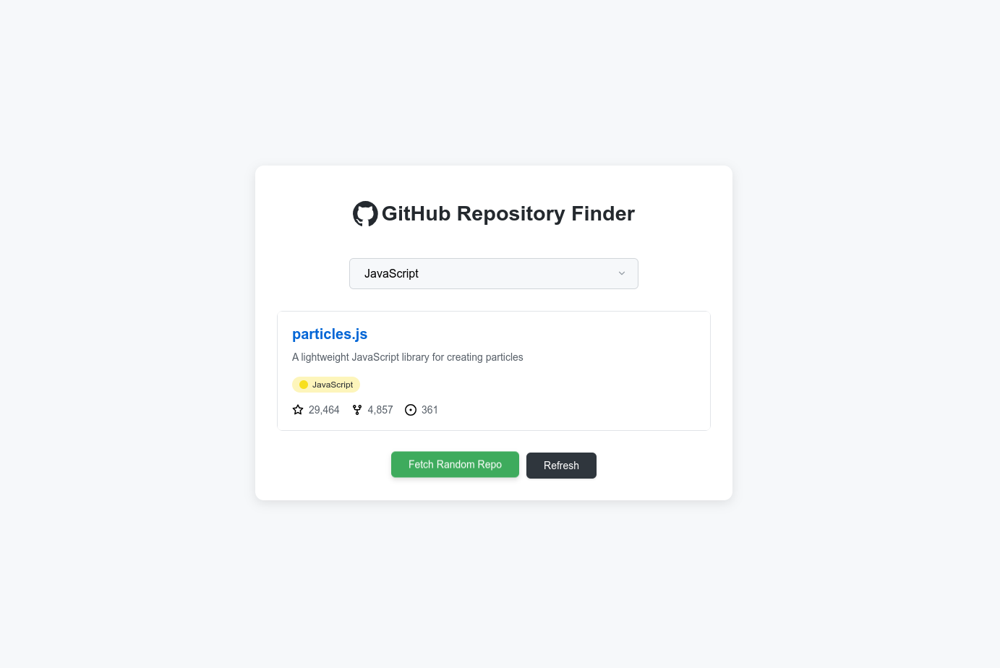
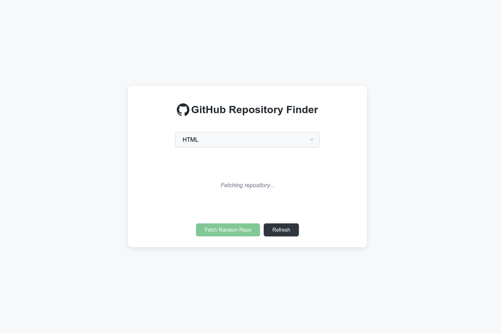
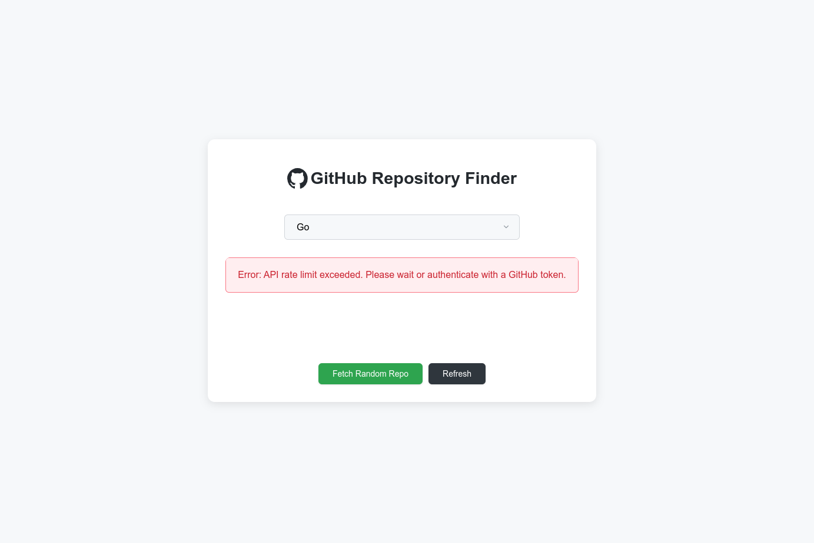

# GitHub-Random-Repository

Check out the live demo: [Click Here](https://trishan0.github.io/GitHub-Random-Repository/)

A web application that helps you discover random GitHub repositories based on programming languages. This tool makes it easy to explore new projects and find interesting repositories you might not encounter otherwise.


## 🌟 Features

- Select from a wide variety of programming languages
- Fetch random repositories based on your selected language
- View key repository information including:
    - Repository name and description
    - Language with color-coded badge
    - Star count
    - Fork count
    - Open issues count
- Direct links to the original repositories
- Responsive design that works on desktop and mobile devices

## 🚀 How It Works

1. Choose a programming language from the dropdown menu
2. Click the "Fetch Random Repo" button
3. The application will display a random popular repository in that language
4. Click the repository name to visit it on GitHub
5. Use the "Refresh" button to discover more repositories without changing the language

## 🧰 Technologies Used

- HTML5
- CSS3
- JavaScript (ES6+)
- GitHub REST API
- Responsive design principles

## 📋 API Usage Note

This application uses the GitHub API which has rate limits for unauthenticated requests. If you encounter rate limit errors, please wait or consider implementing authentication with a GitHub token for higher limits.

## 🖥️ Local Development

To run this project locally:

1. Clone the repository:
   ```bash
   git clone https://github.com/your-username/github-repository-finder.git
   ```

2. Navigate to the project directory:
   ```bash
   cd github-repository-finder
   ```

3. Open `index.html` in your browser or use a local server:
   ```bash
   # Using Python's built-in server (Python 3)
   python -m http.server
   ```

4. The application should now be running at `http://localhost:8000`

## 📚 Project Structure

```
├── assets/
│   └── github-mark.svg
├── scripts/
│   └── script.js
├── styles/
│   └── style.css
├── index.html
├── LICENSE
└── README.md
```

## Screenshots

<div align="center">
  <div style="display: flex; justify-content: center; gap: 20px; margin-bottom: 20px;">
    <div>
      <h3>Home Page</h3>
      
    </div>
    <div>
      <h3>Result</h3>
      
    </div>
  </div>

  <div style="display: flex; justify-content: center; gap: 20px;">
    <div>
      <h3>Fetching Results</h3>
      
    </div>
    <div>
      <h3>Error Handling</h3>
      
    </div>
  </div>
</div>

<div align="center">
  <p><i>GitHub-Random-Repository - A web application that helps you discover random GitHub repositories based on programming languages</i></p>
</div>
## 📄 License

This project is licensed under the MIT License - see the [LICENSE](LICENSE) file for details.

## 🔗 Demo


Original Project Link [Click Here](https://roadmap.sh/projects/github-random-repo)
